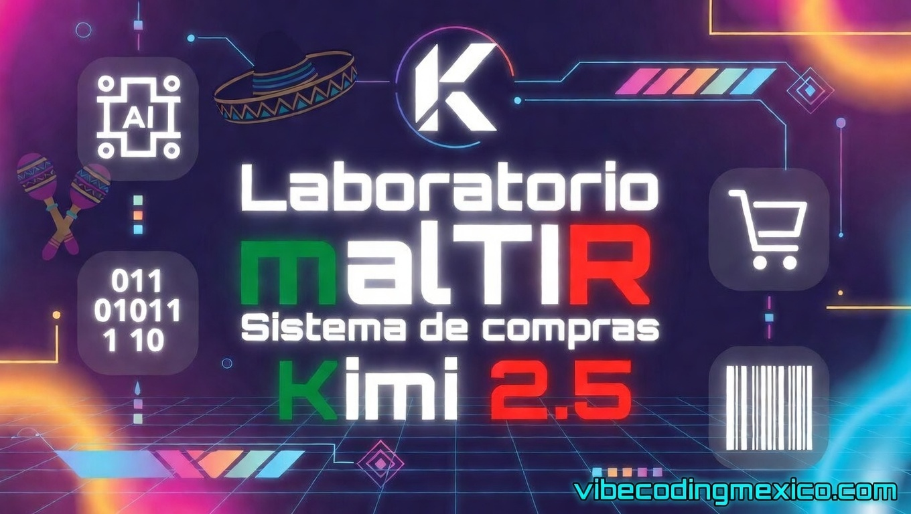

# 🛡️ Proyecto MalTir (Laboratorio KIMI 2.5 — Web)

**MalTir** (palabra rúnica de Diablo II que simboliza **prudencia**) es un sistema de
**Gestión de Compras por Cotización** en PHP procedural. Este repositorio es el
resultado de un experimento de **Vibe Coding** realizado en marzo de 2026, cuyo
objetivo es evaluar a **Kimi 2.5 (versión web)** como generador de código funcional
en proyectos divididos en chunks secuenciales.

---

## 🧬 Origen del Proyecto

La lógica de negocio especificada en este sistema fue diseñada por el autor en 2006.
En 2026 se le pide a **Claude Sonnet 4.6** el 15 de marzo de 2026, volverlo prompts
en colaboración con el autor, a partir de un sistema de cotizaciones **real**
desarrollado originalmente en **Visual Basic 6.0 + Microsoft SQL Server 2000**
en el año **2006** para una empresa transnacional mexicana. Estuvo en operación
por lo menos los cuatro años que estuve allí.

La versión original de 2006 resolvía un problema de negocio crítico:
en procesos de compras con múltiples departamentos y proveedores,
**nadie quería asumir la responsabilidad de los retrasos**.
Los departamentos se culpaban entre sí, y todos culpaban al proveedor.
El sistema original —y este— resuelven eso mediante **puntos de control
no alterables por los usuarios operativos**, con bitácora de cambios
manejada exclusivamente por el área de sistemas.

### Filosofía de control:
- Los usuarios operativos **no pueden alterar estatus** una vez confirmados
- Los departamentos **no pueden echarle la culpa** a otros ni al proveedor
  sin que el sistema lo contradiga con datos
- El área de sistemas **sí puede modificar** estatus en casos justificados,
  pero **cada cambio queda en bitácora** con usuario, fecha y motivo
- Se reconoce que en futuras versiones podrían requerirse **más puntos de
  control** según salud humana, normativas laborales o leyes aplicables —
  esta es una **prueba de concepto** funcional

---

## 🎯 Objetivo del Experimento

Evaluar si **Kimi 2.5 web** puede:
1. Retener el contexto de un prompt maestro complejo a lo largo de 19 chunks
2. Respetar convenciones estrictas de base de datos y frontend en cada paso
3. Generar código PHP procedural funcional y coherente entre módulos
4. Implementar lógica de negocio no trivial con restricciones irreversibles

Se haran cambios necesarios encódigo y se documentaran en vibecodingmexico.com
---

## ⚙️ Especificaciones Técnicas

| Componente | Tecnología |
|---|---|
| Backend | PHP 8.x procedural — sin frameworks |
| Base de datos | MariaDB — utf8mb4 |
| Frontend | Bootstrap 4.6.x + Font Awesome 5 |
| CSS propio | compraskimi.css |
| Arquitectura | Un archivo por módulo (chunk) |
| Ambiente objetivo | cPanel / hospedaje compartido |

---

## 🏗️ Arquitectura del Sistema (19 Chunks)

| # | Archivo | Descripción |
|---|---|---|
| 1 | `crear_tablas.sql` | Estructura completa de BD |
| 2 | `login.php` | Acceso dummy con wallpaper configurable |
| 3 | `headerkimi.php` | Navbar fixed-top + jumbotron |
| 4 | `footerkimi.php` | Footer fixed-bottom con tiempo de carga |
| 5 | `compraskimi.css` | Estilos globales + colores de estatus |
| 6 | `catalogo_unidades.php` | CRUD unidades de medida |
| 7 | `catalogo_incoterms.php` | CRUD incoterms |
| 8 | `catalogo_proveedores.php` | CRUD proveedores |
| 9 | `catalogo_articulos.php` | CRUD artículos con lógica inventario |
| 10 | `crearcotizacion.php` | Crear cotización + partidas |
| 11 | `capturarrespuestacotizacion.php` | Respuesta de proveedor por partida |
| 12 | `autorizarcotizacion.php` | Autorización granular irreversible |
| 13 | `cerrarcotizacion.php` | Cierre + ajustes irreversibles |
| 14 | `consulta_kardex.php` | Consulta de movimientos de inventario |
| 15 | `consulta_cotizaciones.php` | Consulta general con filtros |
| 16 | `entradamercancia.php` | Recepción física de mercancía |
| 17 | `dashboard_pendientes.php` | Dashboard de entregas pendientes |
| 18 | `generar_correo.php` | Texto listo para Outlook/Gmail |
| 19 | `reporte_entrega.php` | Reporte imprimible por cotización |

---

## 🔒 Puntos de Control (No Alterables por Usuarios)

Estos son los controles de integridad que el sistema impone
y que **ningún usuario operativo puede modificar**:

- **Cotización confirmada** → no se pueden agregar partidas ni editar condiciones
- **Respuesta capturada** → precio, fecha y presentación quedan bloqueados
- **Autorización** → solo cambia de `no` a `si`, nunca reversible
- **Cantidad autorizada** → solo puede incrementarse, nunca disminuir
- **Ajuste de partida** → se captura una sola vez al cerrar, irreversible
- **Cierre de cotización** → irreversible, requiere motivo obligatorio
- **Toda modificación de estatus** → registra usuario, fecha y acción en bitácora

> ⚠️ El área de sistemas puede intervenir directamente en BD con justificación,
> pero cada cambio queda registrado. La filosofía es: **los datos no mienten,
> las personas sí**.

---

## 📐 Reglas Globales de Base de Datos

- Todas las fechas: `DATETIME`
- Todas las cantidades: `DECIMAL(14,6)`
- Sin booleanos: `VARCHAR(3)` con `'si'`/`'no'`
- Todas las tablas tienen `activo`, `fecha_alta`, `ultima_actualizacion`,
  `usuario_alta`, `usuario_modifica`
- Prohibido `NOW()` — siempre `CONVERT_TZ(NOW(),'UTC','America/Mexico_City')`
- MySQL en modo no estricto: `SET sql_mode = ''` al inicio

---

## ⚠️ Issues Actuales & Roadmap

- [ ] Sistema completamente dummy — sin seguridad real ni niveles de acceso
- [ ] `$session_usuario = 'YO'` hardcoded — pendiente integrar sesiones reales
- [ ] Imagen de artículo capturada en BD pero no mostrada (campo `imagen BLOB`)
- [ ] Pruebas en móvil pendientes hasta consolidar la interfaz desktop
- [ ] Validar coherencia entre todos los chunks generados por Kimi
- [ ] Posibles puntos de control adicionales según normativas laborales
  o leyes aplicables — esta es una prueba de concepto

---

## 🧪 Notas del Autor (Bitácora de Vibe Coding)

Este proyecto forma parte de la serie de experimentos en
**[vibecodingmexico.com](https://vibecodingmexico.com)**.

Mi nombre es **Alfonso Orozco Aguilar**, mexicano, programador desde 1991.
En 2026 compagino mi carrera como DevOps/Senior Dev con la licenciatura
en Contaduría.

**Hallazgo esperado del experimento:** ¿Puede Kimi 2.5 mantener coherencia
técnica y de negocio a lo largo de 19 prompts independientes, respetando
un prompt maestro que no se repite en cada chunk?
Los resultados se documentarán en el sitio.

**Nota histórica:** La lógica de este sistema sobrevivió 20 años desde su
versión original en VB6. Las reglas de negocio proporcionadas a Claude las
diseñé en 2006 para resolver el problema, así que estas reglas de negocio
fueron adaptadas a prompts por Claude. La revisión se hará según mi tiempo libre.
De momento es AS IS.

El problema de negocio que resuelve — la trazabilidad sin posibilidad de
manipulación departamental — sigue siendo igual de relevante en 2026 que en 2006.

---

## ⚖️ Licencia

Este proyecto se distribuye bajo la licencia **LGPL 2.1**.

---

## ✍️ Acerca del Autor

- **Sitio Web:** [vibecodingmexico.com](https://vibecodingmexico.com)
- **Facebook:** [Alfonso Orozco Aguilar](https://www.facebook.com/alfonso.orozcoaguilar)
